# MatchDesk
## Explainable football intelligence, with the producer in control

MatchDesk is my project for the Inside the Game hackathon. I am building it around a
simple question: **how can a producer turn football events into a story they can actually check?**

My priority is the path from a synthetic match event to a publishable explanation.
The design keeps statistics in deterministic code, uses specialist AI agents to
interpret and present evidence, and gives the producer control over publication.

**Owner: George Okwori. Current stage: Phase 2 in progress; P2-01 TESTED.**
Phase 0 and the deterministic Phase 1 engine are VERIFIED / COMPLETED. The model-independent
Phase 2A orchestration control plane is tested, including bounded retries, timeouts,
recovery and a deterministic verification hand-off. There is still no deployed product,
live Agent Framework/Foundry runtime or live-model integration.

## What is implemented

The deterministic football engine now includes a seeded synthetic simulator,
ordered/idempotent replay ingestion, roster/score/possession reduction, six registered
metric formulas and five explicit moment detectors. The Python API still distinguishes
structural validation from factual verification, and immutable contracts cover claims,
evidence, verification results and approval bindings.

Phase 2A adds a typed control plane for four specialist roles: Tactical Analyst,
Narrative Composer, Editorial Reviewer and Audience Adapter. The controller owns role
order, retry limits, timeout classification, bounded recovery and the verification
hand-off. It does not call a model and it does not give an agent publishing authority.

The latest qualified P2-01 code source passed 226 Python tests, strict Ruff/formatting/
mypy checks, frontend production build, dependency and source-security gates, real
runtime/PostgreSQL restart checks, Chromium regressions and independent native-image
qualification. The new orchestration module has 100% measured statement and branch
coverage.

The PostgreSQL topology is still infrastructure-test scaffolding rather than durable
application persistence. The deterministic claim verifier, scoped specialist execution
adapters, live Agent Framework/Foundry integration, producer publication workflow and
audience outputs remain later work.

Read [current progress](docs/PROGRESS.md) and the [evidence index](docs/evidence/INDEX.md)
before treating any capability as tested or available.

## Architecture

```mermaid
flowchart LR
    S[Seeded synthetic simulator - TESTED] --> I[Ingest and deterministic intelligence - TESTED]
    I --> E[Evidence and claim contracts - implemented]
    E --> C[Bounded four-specialist control plane - TESTED]
    C --> V[Deterministic claim verification - NEXT]
    V --> A[Live Agent Framework / Foundry runtimes - planned]
    A --> P[Producer review and approval - planned]
    P --> O[Overlay and audience outputs - planned]
```



The [solution design](docs/solution-design/02-architecture.md) explains the implemented deterministic boundaries, the tested Phase 2A control plane, planned specialist runtimes and later publication path.

## Reproduce the foundation

The hosted qualification uses Python 3.12.15, Node 22.16.0, npm 10.9.2 and uv 0.10.0.
Install these tools first, then reproduce the committed locks rather than generating
new dependency versions during setup. These instructions remain for isolated
development, not an approved production deployment:

```bash
make setup
uv run --no-sync make foundation
uv run --no-sync make lint
cd apps/web && npm run build
```

`make setup` rejects a stale Python lock; `npm ci` rejects a mismatched npm lock.
`make resolve` is a separate maintenance operation. Review its dependency changes
and run the full checks before committing. The [initial compatibility decision](docs/decisions/ADR-0005-build-compatibility.md)
remains historical. The [patched ASGI decision](docs/decisions/ADR-0007-patched-asgi-dependencies.md)
and [test-client correction](docs/evidence/asgi-upgrade-first-run-20261008.md) explain
the current dependencies without weakening warnings, types or test assertions.

## Try the implemented API

From the repository root after setup:

```bash
uv run --no-sync make api
# In another terminal:
curl http://127.0.0.1:8000/api/health
```

The event schema is at `/api/contracts/event`. POST a JSON event to
`/api/contracts/event/validate`. The response explicitly says `evidence_verified: false`.
`/api/ready` remains intentionally fail-closed because durable persistence, live models and
publication are not operational. The structural validator must not be mistaken for a
verified or production football-intelligence service.

## Local container topology

```bash
python -m scripts.create_local_env
make dev
```

Use WSL2 or another POSIX shell with Docker. The environment generator creates a
local secret without printing or replacing it; do not commit `.env`. API and web
ports bind only to loopback, and PostgreSQL has no host port. New database volumes
initialise TCP authentication with SCRAM. Existing volumes need a separately reviewed
authentication migration; do not delete a database merely to apply these settings.

The standalone web image compiles its non-secret API upstream during the build.
Unused pip/npm/Yarn/Corepack are excluded from the final service images, not the
build stages. Image inventories and actual runtime/browser tests check the result;
The qualified native-image gate currently passes on the tested source. The
[integration method](docs/testing/integration-foundation.md) and
[image-security method](docs/testing/runtime-image-security.md) explain the scope.
No public demo is hosted yet.

## Tests, comments and documentation

`make foundation` runs regression tests, schema-drift checks, documentation link checks
and Python docstring-presence checks. `make lint` runs Ruff, formatting, strict mypy
and frontend type checks. Independent integration, advisory and source-security workflows
retain failures, source IDs, hashes, JUnit, screenshots, SARIF and redacted scan reports.
The [evidence index](docs/evidence/INDEX.md) separates historical image-security failures from later passing qualifications and the current Phase 2A evidence.

Every authored Python module, class and function has a docstring. Non-obvious
validation, concurrency and security decisions have explanatory comments. Browser
helpers, controlled fixtures, container definitions and CI steps document their intent.
TypeScript includes compile-time regression checks for the platform declarations
used by Next.js. See the [coding standard](docs/engineering/coding-standard.md).

## Navigation

[Project specification](docs/project-specification.md) · [Project story](docs/project-story.md)
· [Testing strategy](docs/testing/test-strategy.md) · [Operations](docs/operations/runbook.md)
· [Requirements traceability](docs/competition/traceability-matrix.md)
· [Foundation merge checklist](docs/operations/foundation-merge-checklist.md)
· [Repository controls for review](docs/operations/repository-controls.md)

## Data, AI and licence

All supplied example data is invented. No real match footage, team branding or
player likeness is included. Synthetic xG is an illustrative estimate, not a
calibrated professional model. Runtime agents and their limits remain explicit in the
[responsible-AI design](docs/solution-design/12-responsible-ai.md). The deterministic
orchestration control plane is implemented, but no live model integration is connected in this snapshot.

Original project source is provided under the [MIT licence](LICENSE).
