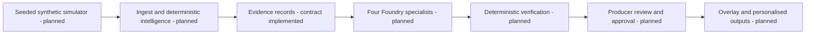

# MatchDesk
## Explainable football intelligence, with the producer in control

MatchDesk is my project for the Inside the Game hackathon. I am building it around a
simple question: **how can a producer turn football events into a story they can actually check?**

My priority is the path from a synthetic match event to a publishable explanation.
The design keeps statistics in deterministic code, uses specialist AI agents to
interpret and present evidence, and gives the producer control over publication.

**Owner: George Okwori. Current stage: Phase 0 foundation, local work only.**
There is no deployed product or live Foundry integration in this snapshot.

## What is implemented

The Python API validates synthetic event structure, returns a content digest,
exposes its schema and differentiates process liveness from product readiness.
Immutable domain models cover events, windows, claims, evidence, verification
results and approval bindings. Structural validation is not factual verification.

The source also includes a Next.js contract workbench, Compose topology and a
foundation CI workflow. Their full execution remains blocked pending dependency
resolution and the required runtimes. The simulator, match statistics, agents,
producer queue, translations and publication pipeline are not implemented yet.

Read [current progress](docs/PROGRESS.md) and the [evidence index](docs/evidence/INDEX.md)
before treating any capability as tested or available.

## Architecture



The [solution design](docs/solution-design/02-architecture.md) explains boundaries,
planned services, failure paths and what this foundation currently exercises.

## Try the implemented API

The target runtime is Python 3.12. The initial local evidence uses preinstalled
Python 3.13.5 and is supplementary, not a substitute for the target-runtime gate.

With the dependencies recorded in `pyproject.toml` installed:

```bash
make api
# In another terminal:
curl http://127.0.0.1:8000/api/health
```

The event schema is at `/api/contracts/event`. POST a JSON event to
`/api/contracts/event/validate`. The response explicitly says `evidence_verified: false`.
`/api/ready` returns HTTP 503 because the product dependencies are not implemented.

## Full local setup after network access is available

`make setup` resolves and installs dependencies. Review and commit `uv.lock` and
`apps/web/package-lock.json` before qualification; they are intentionally absent
rather than fabricated in this network-restricted snapshot. Narrow the temporary
React type-package ranges to the resolved exact versions at that point.

```bash
make setup
python -m scripts.create_local_env
make dev
```

Use WSL2 or another POSIX shell with Docker, Node 22 and uv. The Compose stack is
local-only; it does not establish working PostgreSQL integration by merely starting
a database container. Its execution has not been tested in this environment.

## Tests, comments and documentation

`make foundation` runs the implemented local tests, schema-drift check, documentation
link check and Python docstring-presence check. `make lint` requires Ruff, mypy and
frontend type checking. `make evidence` records actual commands and environment
limits; an unmet gate returns a nonzero exit status and remains visible.

Every authored Python module, class and function has a docstring. Non-obvious
validation and security decisions have explanatory comments. TypeScript source,
configuration and CI include intent comments; generated JSON uses schema descriptions.
See the [coding standard](docs/engineering/coding-standard.md).

## Navigation

[Project specification](docs/project-specification.md) · [Project story](docs/project-story.md)
· [Testing strategy](docs/testing/test-strategy.md) · [Operations](docs/operations/runbook.md)
· [Requirements traceability](docs/competition/traceability-matrix.md)

## Data, AI and licence

All supplied example data is invented. No real match footage, team branding or
player likeness is included. Synthetic xG is an illustrative estimate, not a
calibrated professional model. Planned runtime agents and their limits remain
explicit in the [responsible-AI design](docs/solution-design/12-responsible-ai.md).
No live model integration is connected in this snapshot.

Original project source is provided under the [MIT licence](LICENSE).
