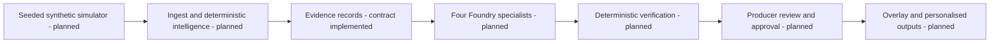

# MatchDesk
## Explainable football intelligence, with the producer in control

MatchDesk is my project for the Inside the Game hackathon. I am building it around a
simple question: **how can a producer turn football events into a story they can actually check?**

My priority is the path from a synthetic match event to a publishable explanation.
The design keeps statistics in deterministic code, uses specialist AI agents to
interpret and present evidence, and gives the producer control over publication.

**Owner: George Okwori. Current stage: Phase 0 foundation; final merge gates open.**
The recorded build, runtime/browser, dependency and source-security checks pass.
Native image scanning, repository protections and final review remain outstanding.
There is no deployed product or live Foundry integration.

## What is implemented

The Python API validates synthetic event structure, returns a content digest,
exposes its schema and differentiates process liveness from product readiness.
Immutable domain models cover events, windows, claims, evidence, verification
results and approval bindings. Structural validation is not factual verification.

The Next.js workbench builds and runs as a standalone container against the real API.
The recorded source passed 78 Python tests, strict static checks, schema/documentation
checks, nine runtime groups and 24 Chromium browser cases at three viewport sizes.
An input revision guard prevents an old in-flight response from accepting edited text.

The isolated PostgreSQL topology passes transaction, uniqueness, password and restart
probes. These are not application persistence or migration tests. The simulator,
match statistics, agents, producer queue, translations and publication pipeline are
not implemented yet. The [security remediation report](docs/evidence/security-remediation-20261008.md)
records the patched dependencies, passing audits and precise limits of the result.

Read [current progress](docs/PROGRESS.md) and the [evidence index](docs/evidence/INDEX.md)
before treating any capability as tested or available.

## Architecture



The [solution design](docs/solution-design/02-architecture.md) explains boundaries,
planned services, failure paths and what this foundation currently exercises.

## Reproduce the foundation

The hosted qualification uses Python 3.12.15, Node 22.16.0, npm 10.9.2 and uv 0.10.0.
Install these tools first, then reproduce the committed locks rather than generating
new dependency versions during setup. These instructions remain for isolated
development, not an approved production deployment:

```bash
make setup
uv run --no-sync make foundation
uv run --no-sync make lint
cd apps/web && npm run build
```

`make setup` rejects a stale Python lock; `npm ci` rejects a mismatched npm lock.
`make resolve` is a separate maintenance operation. Review its dependency changes
and run the full checks before committing. The [initial compatibility decision](docs/decisions/ADR-0005-build-compatibility.md)
remains historical. The [patched ASGI decision](docs/decisions/ADR-0007-patched-asgi-dependencies.md)
and [test-client correction](docs/evidence/asgi-upgrade-first-run-20261008.md) explain
the current dependencies without weakening warnings, types or test assertions.

## Try the implemented API

From the repository root after setup:

```bash
uv run --no-sync make api
# In another terminal:
curl http://127.0.0.1:8000/api/health
```

The event schema is at `/api/contracts/event`. POST a JSON event to
`/api/contracts/event/validate`. The response explicitly says `evidence_verified: false`.
`/api/ready` returns HTTP 503 because the product dependencies are not implemented.
The structural validator must not be mistaken for a verified football intelligence service.

## Local container topology

```bash
python -m scripts.create_local_env
make dev
```

Use WSL2 or another POSIX shell with Docker. The environment generator creates a
local secret without printing or replacing it; do not commit `.env`. API and web
ports bind only to loopback, and PostgreSQL has no host port. New database volumes
initialise TCP authentication with SCRAM. Existing volumes need a separately reviewed
authentication migration; do not delete a database merely to apply these settings.

The standalone web image compiles its non-secret API upstream during the build.
The [integration method](docs/testing/integration-foundation.md) explains browser
setup, isolated probes, measured scope and limitations. No public demo is hosted yet.

## Tests, comments and documentation

`make foundation` runs regression tests, schema-drift checks, documentation link checks
and Python docstring-presence checks. `make lint` runs Ruff, formatting, strict mypy
and frontend type checks. Independent integration, advisory and source-security workflows
retain failures, source IDs, hashes, JUnit, screenshots, SARIF and redacted scan reports.
The [current qualification report](docs/evidence/security-remediation-20261008.md) preserves
the earlier failures and distinguishes passing checks from foundation merge approval.

Every authored Python module, class and function has a docstring. Non-obvious
validation, concurrency and security decisions have explanatory comments. Browser
helpers, controlled fixtures, container definitions and CI steps document their intent.
TypeScript includes compile-time regression checks for the platform declarations
used by Next.js. See the [coding standard](docs/engineering/coding-standard.md).

## Navigation

[Project specification](docs/project-specification.md) · [Project story](docs/project-story.md)
· [Testing strategy](docs/testing/test-strategy.md) · [Operations](docs/operations/runbook.md)
· [Requirements traceability](docs/competition/traceability-matrix.md)
· [Foundation merge checklist](docs/operations/foundation-merge-checklist.md)

## Data, AI and licence

All supplied example data is invented. No real match footage, team branding or
player likeness is included. Synthetic xG is an illustrative estimate, not a
calibrated professional model. Planned runtime agents and their limits remain
explicit in the [responsible-AI design](docs/solution-design/12-responsible-ai.md).
No live model integration is connected in this snapshot.

Original project source is provided under the [MIT licence](LICENSE).
