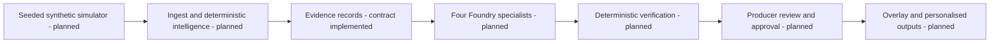

# MatchDesk
## Explainable football intelligence, with the producer in control

MatchDesk is my project for the Inside the Game hackathon. I am building it around a
simple question: **how can a producer turn football events into a story they can actually check?**

My priority is the path from a synthetic match event to a publishable explanation.
The design keeps statistics in deterministic code, uses specialist AI agents to
interpret and present evidence, and gives the producer control over publication.

**Owner: George Okwori. Current stage: Phase 0 foundation; hosted build checks passing.**
The full Phase 0 gate remains open. There is no deployed product or live Foundry integration.

## What is implemented

The Python API validates synthetic event structure, returns a content digest,
exposes its schema and differentiates process liveness from product readiness.
Immutable domain models cover events, windows, claims, evidence, verification
results and approval bindings. Structural validation is not factual verification.

The Next.js contract workbench now type-checks and produces an optimized production
build in GitHub Actions. The committed dependency locks, Python 3.12 regression
suite, strict static checks, schema snapshots and documentation checks have passed
on the recorded source. A successful build is not a deployed or browser-qualified product.

The Compose topology still needs execution and integration testing. The simulator,
match statistics, agents, producer queue, translations and publication pipeline are
not implemented yet.

Read [current progress](docs/PROGRESS.md) and the [evidence index](docs/evidence/INDEX.md)
before treating any capability as tested or available.

## Architecture



The [solution design](docs/solution-design/02-architecture.md) explains boundaries,
planned services, failure paths and what this foundation currently exercises.

## Reproduce the foundation

The hosted qualification uses Python 3.12.15, Node 22.16.0, npm 10.9.2 and uv 0.10.0.
Install these tools first, then reproduce the committed locks rather than generating
new dependency versions during setup:

```bash
make setup
uv run --no-sync make foundation
uv run --no-sync make lint
cd apps/web && npm run build
```

`make setup` rejects a stale Python lock; `npm ci` rejects a mismatched npm lock.
`make resolve` is a separate maintenance operation. Review its dependency changes
and run the full checks before committing. The [compatibility decision](docs/decisions/ADR-0005-build-compatibility.md)
explains the current AnyIO and TypeScript pins without weakening the checks.

## Try the implemented API

From the repository root after setup:

```bash
uv run --no-sync make api
# In another terminal:
curl http://127.0.0.1:8000/api/health
```

The event schema is at `/api/contracts/event`. POST a JSON event to
`/api/contracts/event/validate`. The response explicitly says `evidence_verified: false`.
`/api/ready` returns HTTP 503 because the product dependencies are not implemented.
The structural validator must not be mistaken for a verified football intelligence service.

## Local container topology: qualification pending

```bash
python -m scripts.create_local_env
make dev
```

Use WSL2 or another POSIX shell with Docker. The environment generator creates a
local secret without printing or replacing it; do not commit `.env`. The Compose
stack is local-only and its integrated execution is not yet qualified. Starting a
database container would not by itself establish application persistence or migrations.

## Tests, comments and documentation

`make foundation` runs regression tests, schema-drift checks, documentation link checks
and Python docstring-presence checks. `make lint` runs Ruff, formatting, strict mypy
and frontend type checks. CI preserves source IDs, hashes, JUnit, coverage and logs
for both successful and failed runs. The [first passing hosted record](docs/evidence/hosted-foundation-20261008.md)
contains the scope and limitations of those results.

Every authored Python module, class and function has a docstring. Non-obvious
validation and security decisions have explanatory comments. TypeScript includes
compile-time regression checks for the platform declarations used by Next.js.
The formatting review preserved the existing docstrings, comments and functional AST.
See the [coding standard](docs/engineering/coding-standard.md).

## Navigation

[Project specification](docs/project-specification.md) · [Project story](docs/project-story.md)
· [Testing strategy](docs/testing/test-strategy.md) · [Operations](docs/operations/runbook.md)
· [Requirements traceability](docs/competition/traceability-matrix.md)

## Data, AI and licence

All supplied example data is invented. No real match footage, team branding or
player likeness is included. Synthetic xG is an illustrative estimate, not a
calibrated professional model. Planned runtime agents and their limits remain
explicit in the [responsible-AI design](docs/solution-design/12-responsible-ai.md).
No live model integration is connected in this snapshot.

Original project source is provided under the [MIT licence](LICENSE).
