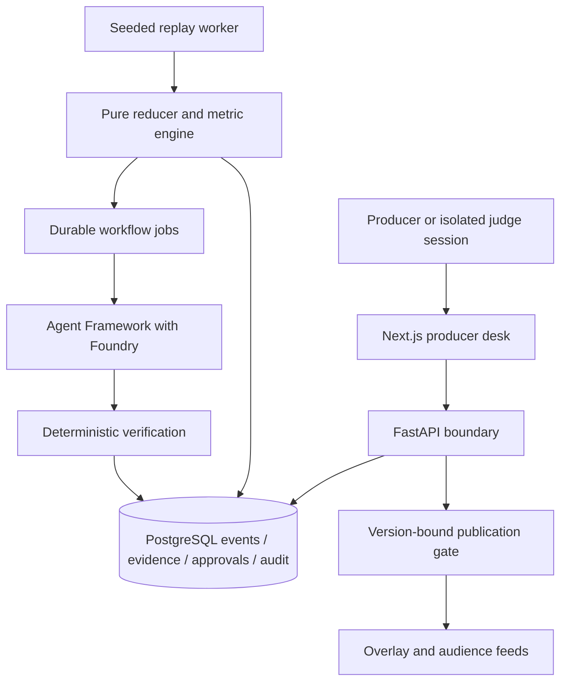

# Architecture and trust boundaries

Status: proposed whole-system design with Phase 0/1 implemented and Phase 2A orchestration control plane TESTED.

The modular backend separates simulation, ingestion, state, intelligence, verification,
agents, API and infrastructure. Phase 1 implements the deterministic simulator, ingestion,
reducer, registered metrics and moment detection. Phase 2A adds a model-independent typed
orchestration control plane for the four specialist roles, with bounded retry, timeout,
recovery and deterministic verification hand-off. No persistence adapter or live agent
execution is represented as complete.

Numerical truth belongs to registered deterministic queries. Narrative reasoning is
an interpretation of that evidence. Publishing authority belongs to an authenticated
producer action, never an agent's generated status. Model/tool calls use scoped read
interfaces and cannot modify metric evidence or approval records. The Phase 2A controller,
not a specialist runtime, owns role order, retry budget, timeout classification, recovery
budget and eligibility to cross the verification hand-off.

Replay cursors, workflow identities and published outputs must include session and
replay generation. Resetting one judge session cannot invalidate another. A future
transactional outbox links committed publication to its output stream; a crash between
commit and delivery must not duplicate publication.

SSE conveys versioned state changes and resumes from a scoped cursor. An HTTP command
changes state only after request identity, authorisation and concurrency checks pass.
