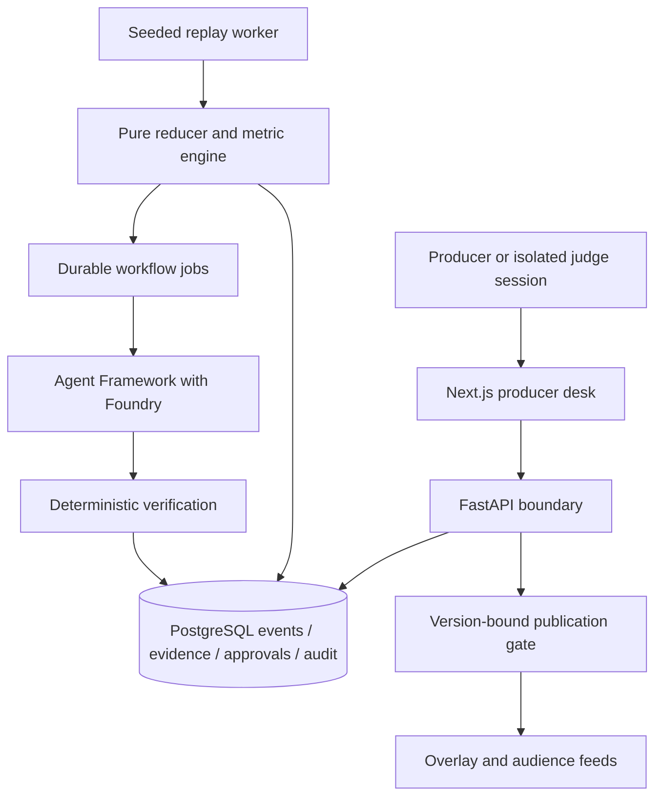

# Architecture and trust boundaries

Status: proposed whole-system design; Phase 0/1/2 VERIFIED / COMPLETED and Phase 3 P3-01/P3-02 pure domain controls TESTED.

The modular backend separates simulation, ingestion, state, intelligence, verification,
agents, API and infrastructure. Phase 1 implements the deterministic simulator, ingestion,
reducer, registered metrics and moment detection. Phase 2 implements a model-independent
typed orchestration control plane for four specialist roles, scoped read-only specialist
tools, deterministic claim verification, a fail-closed Microsoft Agent Framework / Foundry
runtime, bounded retry/timeout/recovery controls and deterministic model-output evaluation.
One bounded live Foundry tactical proposal has passed the same evidence-verification path.
Phase 3 now includes tested pure-domain producer review and publication gating.
Authenticated producer commands, durable approval records, transactional delivery
and production workflow persistence remain later work.

Numerical truth belongs to registered deterministic queries. Narrative reasoning is
an interpretation of that evidence. Publishing authority belongs to an authenticated
producer action, never an agent's generated status. Model/tool calls use scoped read
interfaces and cannot modify metric evidence or approval records. The Phase 2 controller,
not a specialist runtime, owns role order, retry budget, timeout classification, recovery
budget and eligibility to cross the verification hand-off. Live model output remains a
non-authoritative proposal and must pass deterministic evaluation before later workflow
stages can rely on it.

Replay cursors, workflow identities and published outputs must include session and
replay generation. Resetting one judge session cannot invalidate another. A future
transactional outbox links committed publication to its output stream; a crash between
commit and delivery must not duplicate publication.

SSE conveys versioned state changes and resumes from a scoped cursor. An HTTP command
changes state only after request identity, authorisation and concurrency checks pass.
