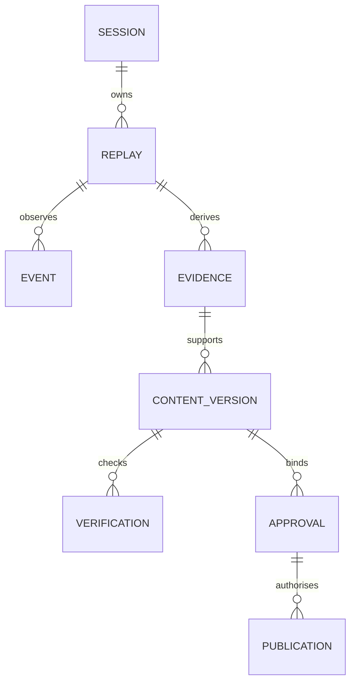

# Data contracts and temporal semantics

Status: version-1 boundary models implemented; database schema and roster reducer planned.

The source of truth for accepted fields is `backend/src/matchdesk/domain/models.py`.
The [contract manifest](../../contracts/manifest.json) hashes exported structural schemas.
Cross-field checks run in Python and are not all expressible in the JSON schema.

| Contract | Purpose | Important boundary |
|---|---|---|
| MatchEvent | Synthetic action or lifecycle event | Unknown fields and type coercion are rejected |
| Location | 0-100 spatial coordinate | Not metres; non-finite and boolean values rejected |
| MatchWindow | One-period half-open time window | End is exclusive; nonempty; second half starts at 45:00 |
| MetricAssertion | Metric/subject/window/comparator | Shape is not truth; query registration remains required |
| Claim | Text, claim kind and evidence IDs | References are unique; a measured claim requires an assertion |
| EvidenceRecord | Match/replay/revision/source identity | Supports future invalidation and re-querying |
| VerificationResult | Checker status and query identity | Does not grant publishing permission |
| ApprovalBinding | Exact content/evidence/version/audience | Hash is content identity, not an authentication signature |

`match_clock_ms` is the nominal display clock, not continuous elapsed real time.
A first-half event at 48:00 can precede a second-half event at 45:00. Order uses period
and sequence, not display-clock sorting alone. Arrival time will be stored separately
by the future ingestion adapter. Window queries may not silently cross periods.

Pitch coordinates are oriented to the event team's attacking direction. Overlay rendering
must transform them into one physical display frame before joining different teams'
actions. Distances require explicit pitch-length and pitch-width scaling.

Goal markers reference shot events. The reducer must enforce exactly-once scoring,
reference existence, current rosters and possession ownership. Phase 0 checks only
that a reference is present and that event-type fields are structurally coherent.

The ER diagram is planned, not an executed database migration.
