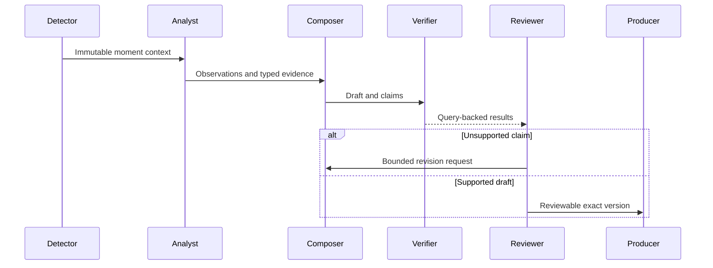

# Runtime agents and orchestration

Status: design only. No Microsoft Agent Framework package or Foundry endpoint is connected.

| Specialist | Responsibility | Authority |
|---|---|---|
| Tactical Analyst | Interpret moment context and identify observations/inferences | Read-only events and registered metrics |
| Narrative Composer | Produce sentence-to-claim mapped narrative variants | Draft text only |
| Editorial Reviewer | Review wording and use deterministic verifier outcomes | Request revisions, never override numerical checks |
| Audience Adapter | Adapt tone and language while preserving facts | New draft versions requiring fresh verification |

The orchestrator is code. Workflow state, retries, idempotency keys and failure reasons
must persist outside a process before crash recovery is claimed. Specialist requests
include a correlation ID, replay identity, model/prompt versions and bounded token budget.

A provider failure creates a labelled factual template only from verified facts. Cached
output and recorded model responses remain visibly distinct from live inference.
Final model and SDK versions require quota/region discovery and a compatibility spike.

Reference checked 8 October 2026: [Microsoft Agent Framework overview](https://learn.microsoft.com/en-us/agent-framework/overview/).
